# Historic City Of Preston 

A brief introduction to Preston, the city of history and scenery, and some of its attractions.
This website is a fictitious site created as part of a full stack development course run by the Code Institute, <https://www.codeinstitute.net/>.
The site has been created by utilising HTML and CSS.

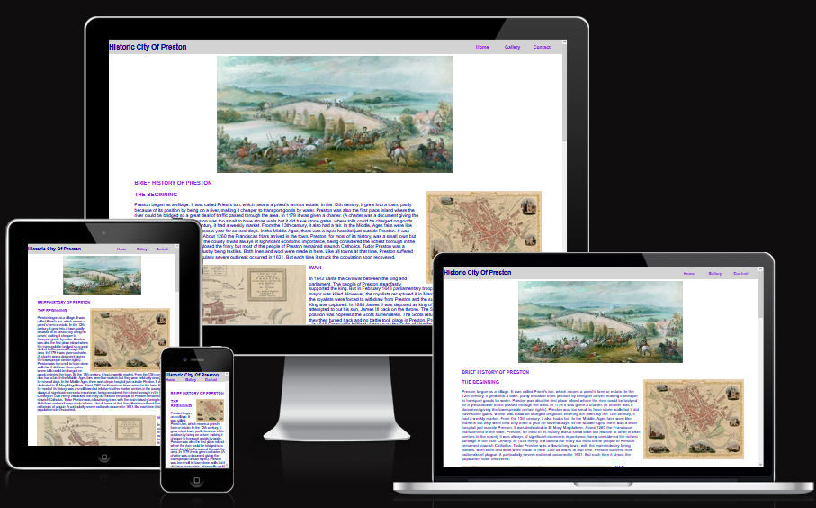

# Table of Contents 

* [Design](#design)

    * Technologies Used 
    * Frameworks, Libraries, Programs Used

* [User Experience](#user-experience)

    * Features

        * Current Features
        * Future Enhancements

* [Testing](#testing)

    * HTML Validation
    * CSS Validation
    * Manual Testing
    * Functional Testing
    * Website Performance Test
    * Issues Encountered

* [Deployment](#deployment)

    * Github Pages
    * Local Clone

* [Credits and Acknowledgements](#credits-and-acknowledgements)

## Design

Wireframes are created using balsamiq software.  Font family used: Arial, Helvetica, sans-serif.
All content was written by the developer.

### Technologies Used

- HTML
- CSS

### Frameworks, Libraries, Programs Used

- Gitpod
- Github
- Flexbox
- Fontawsome
- Am I Responsive
- Lighthouse
- W3C HTML/CSS validator
- W3C Markup Validator

#### Home Page Wireframe

#### Home Page Wireframe - Mobile

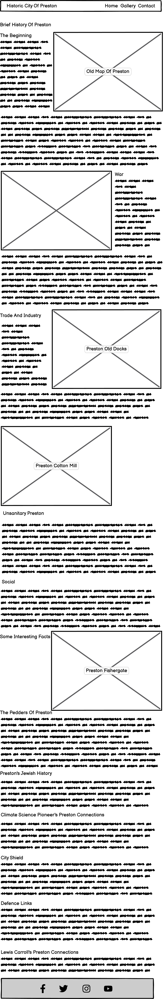

#### Gallery Page Wireframe

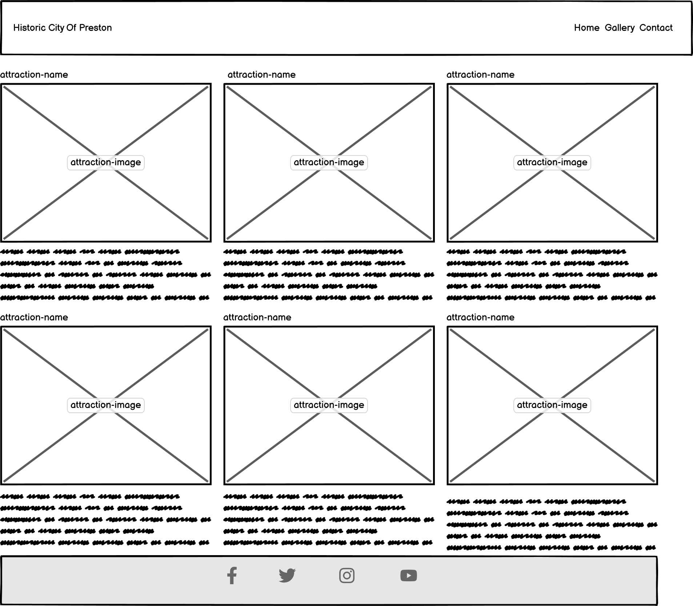

#### Gallery Page Wireframe - Mobile

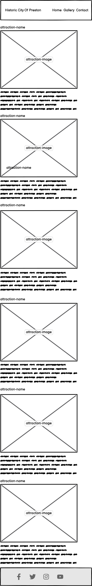

#### Contact Page Wireframe

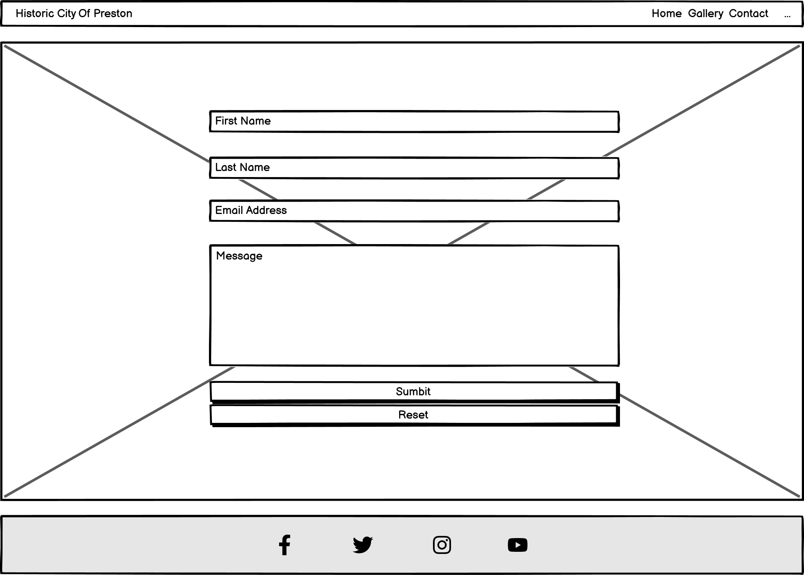

#### Contact Page Wireframe - Mobile

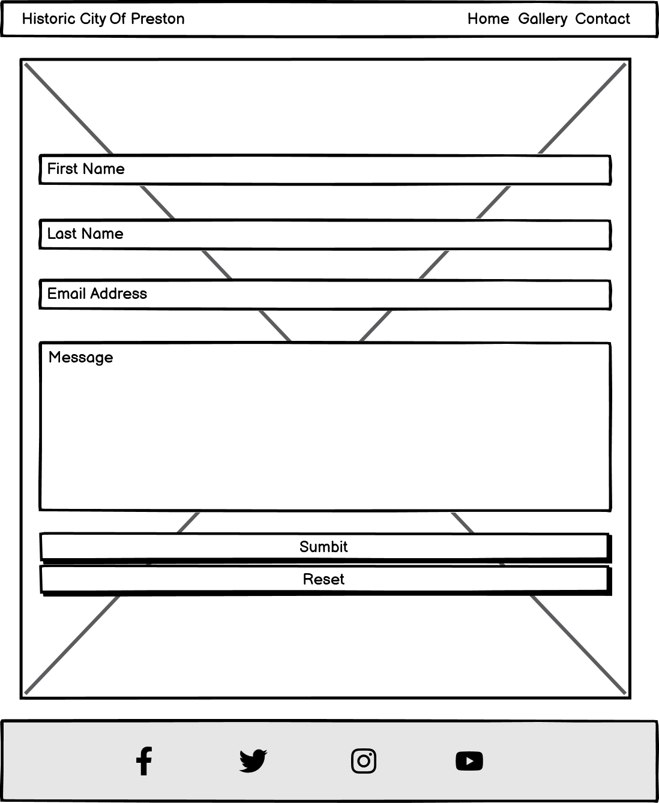

## User Experience

On this website, users will be introduced to a brief history of Preston, UK, and a handful of attractions on offer, in or around the city.  Functionality is as described under the following section.

### Features

- pages to inform visitors and showcase some of Preston’s attractions
- navigation bar provides easy access to all pages
- gallery page provides access to external links for information on each attraction listed
- footer provides links to the four most popular social sites
- contact page provides users with a feedback form to gather their comments on each attraction visited
- responsive on all device sizes

#### Current Features

- Navigation bar
    - Consistent and placed on top of all pages
    - Provides links to Home, Gallery, and Contact pages
    - No need to use the browser “back/forward” buttons to navigate pages
    - Hovering mouse over each menu item will highlight the selection

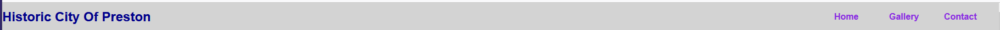

- Home page
    - At the top of the page is the navigation bar
    - Hero image depicts the civil war battle in 1648
    - Hero image has a zoom out effect on the first load and the subsequent refreshes
    - Contains a brief history of Preston and some important dates/events
    - Contains maps of old Preston, civil war
    - Contains images of important locations in Preston
    - Includes some miscellaneous, and yet interesting, facts 
    - At the bottom of the page is the footer

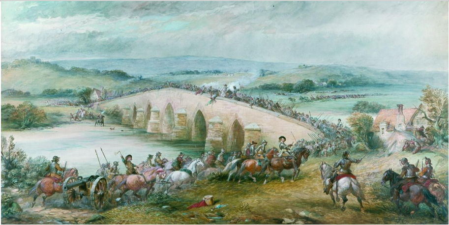

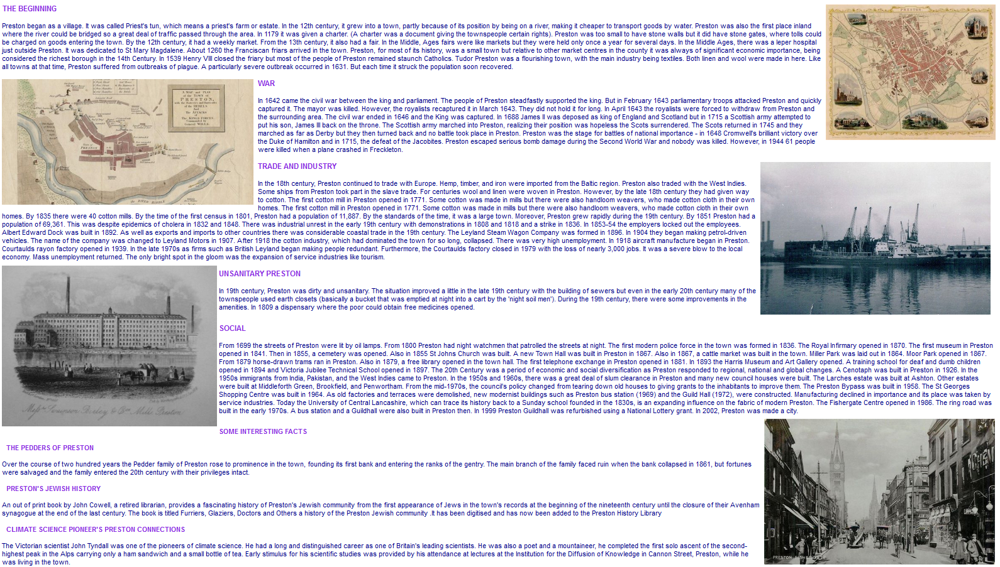

- Footer
    - Consistent footer at the bottom of all pages
    - Contains access to the four popular social media sites
    - Hovering mouse over each link will highlight the selection

- Gallery page
    - At the top of the page is the navigation bar
    - Hero image is from the Ribble river running through the city
    - Hero image has a zoom out effect on the first load and the subsequent refreshes
    - On desktop/laptop hovering mouse over the name of the attraction has a zoom out effect
    - On desktop/laptop hovering mouse over the attraction image has an opacity effect
    - On desktop/laptop hovering mouse over the attraction description highlights the selection
    - Contains name, image, and description of some attraction sites
    - At the bottom of the page is the footer

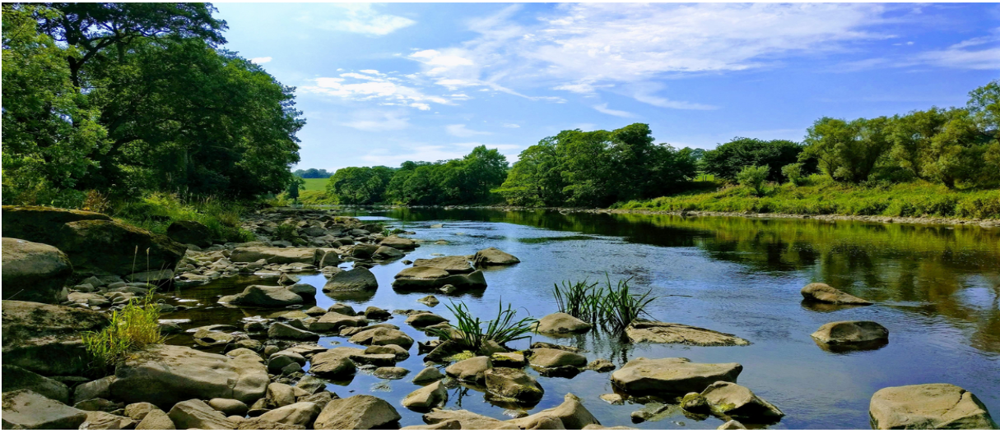

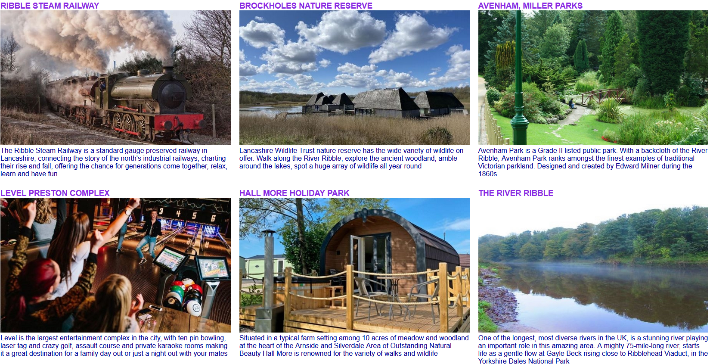

- Contact page
    - At the top of the page is the navigation bar
    - The background image is the Martyrs Memorial commemorating workers killed demonstrating for fair pay in 1842
    - Contains a feedback form to be used to improve services 
    - First and last name fields, as well as the email address, are marked as required
    - Active field’s background colour changes when mouse hovers over it
    - A popup box thanks the user for the feedback after the submit button is pressed
    - At the bottom is the footer 

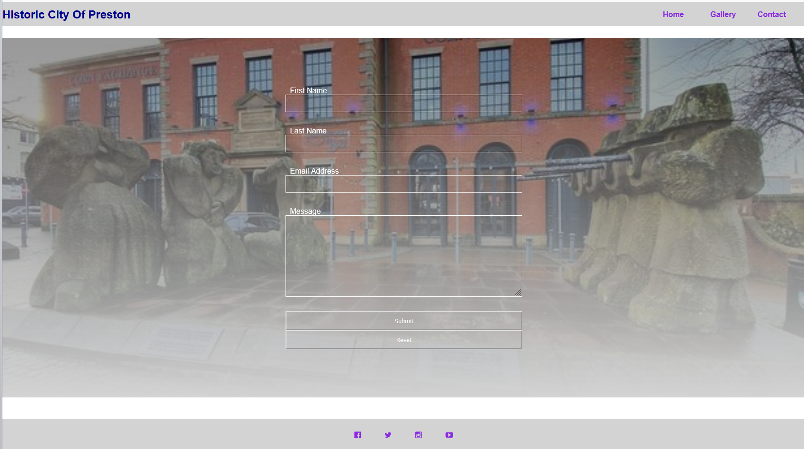

### User Stories

Visitors to the site:
- learn about Preston’s past
- be able to use the menu bar to navigate available pages
- be introduced to some of Preston's attractions
- have the option to be directed to a specific attraction's site for further information
- be able to provide a feedback
- be able to view the website on different devices

### Testing

HTML Validation

- Home Page

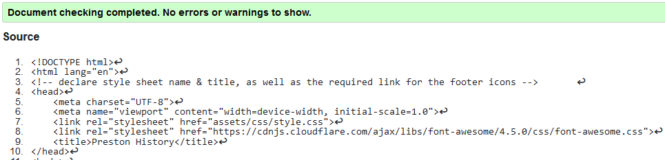

- Gallery Page

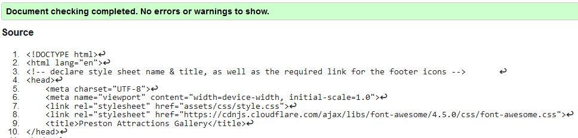

- Contact Page

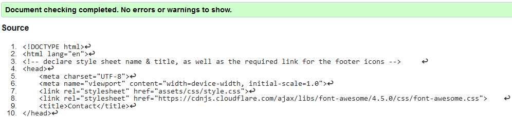

- CSS

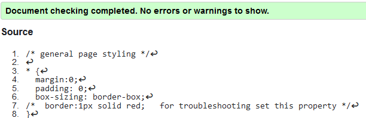

Manual Testing

The website was tested manually, using MS Edge/Google Chrome development tools.  All available device settings were tested one at a time by:
- Load pages on Firefox, MS Edge, Google Chrome
- Taking advantage of the development tool on the above platforms to test different viewports
- Navigating to each page using the menu bar
- Scrolling up and down
- Accessing external attraction sites from the Gallery page
- Testing the feedback form

Functional Testing

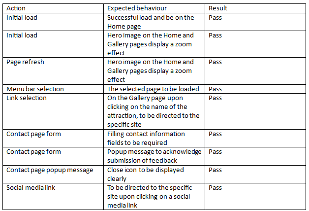

Website Performance Test

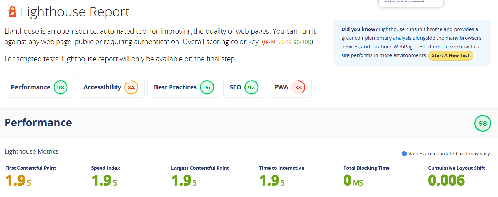

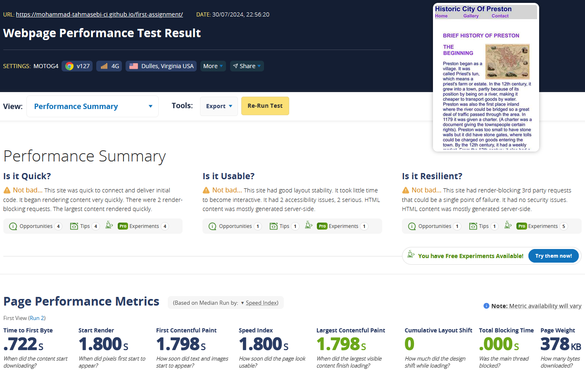

### Issues Encountered

- Misspelling in the style.css were resolved
- Feedback form not being displayed correctly on some devices was resolved
- Text entered in the form’s input fields not having sufficient contrast was resolved
- Visibility of the Close icon, of the popup message, on the Submit on the Contact page was adjusted

### Deployment

Github Pages

GitHub Pages used to deploy live version of the website.
1.	Log in to GitHub and locate GitHub Repository First-Assignment
2.	At the top of the Repository(not the main navigation) locate "Settings" button on the menu.
3.	Scroll down the Settings page until you locate "GitHub Pages".
4.	Under "Source", click the dropdown menu "None" and select "Main" and click "Save".
5.	The page will automatically refresh.
6.	Scroll back to locate the now-published site link in the "GitHub Pages" section.

Forking the GitHub Repository

By forking the repository, we make a copy of the original repository on our GitHub account to view and change without affecting the original repository by using these steps:
1.	Log in to GitHub and locate GitHub Repository First-Assignment 
2.	At the top of the Repository(under the main navigation) locate "Fork" button.
3.	Now you should have a copy of the original repository in your GitHub account.

Local Clone

1.	Log in to GitHub and locate GitHub Repository First-Assignment
2.	Under the repository name click "Clone or download"
3.	Click on the code button, select clone with HTTPS, SSH or GitHub CLI and copy the link shown.
4.	Open Git Bash
5.	Change the current working directory to the location where you want the cloned directory to be made.
6.	Type git clone and then paste The URL copied in the step 3.
7.	Press Enter and your local clone will be created.

### Credits and Acknowledgements

My mentor, Mitko Bachvarov, for providing helpful feedback, and links to different guides, to assist me with this project.

Miguel Ortega Logorreta, learning assistant, for the advice and guidance offered to assist with this project.

Code Institute for the educational materials.

